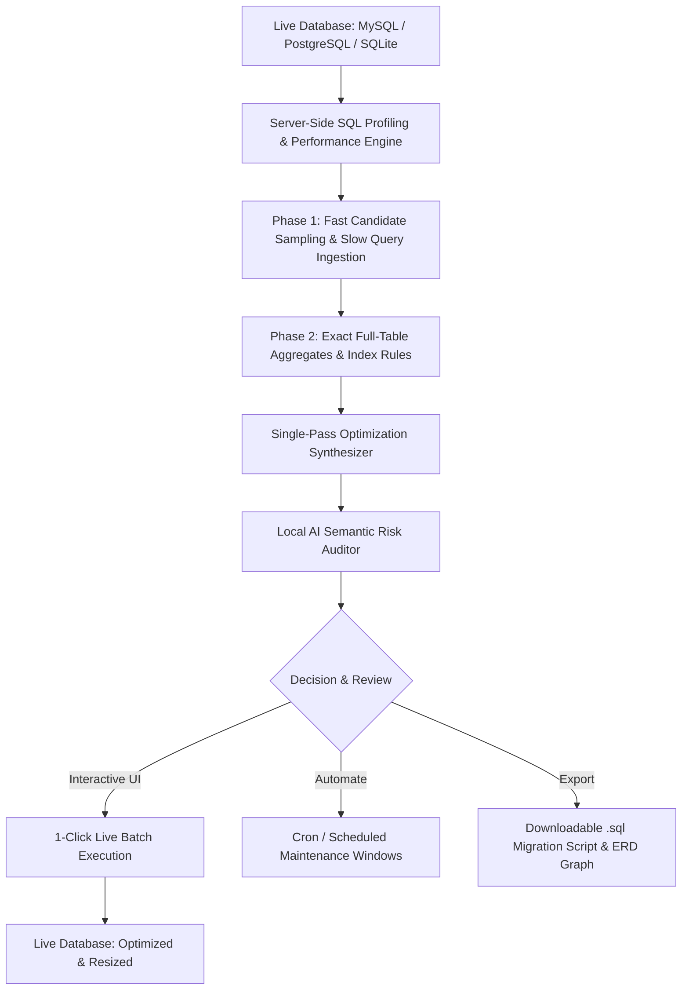

<div align="center">

# 🗄️ SQL Helper
### *The Intelligent, AI-Powered Database Performance, Compaction & Schema Optimization Workbench*

[](https://www.python.org/)
[](https://streamlit.io/)
[](https://www.mysql.com/)
[](https://www.postgresql.org/)
[](https://www.sqlite.org/)
[](https://ollama.com/)
[](https://opensource.org/licenses/MIT)

<br/>

**SQL Helper** is a modern, high-performance database optimization suite designed for DBAs, Software Engineers, and Data Architects. It bridges the gap between **100% mathematically exact server-side SQL profiling** and **Local AI semantic domain intelligence** to reclaim gigabytes of disk storage, optimize buffer pool RAM, eliminate slow query bottlenecks, and prevent schema bugs.

---

[⚠️ Disclaimer](#️-critical-disclaimer--limitation-of-liability) •
[Key Highlights](#-key-highlights) •
[Architecture](#-architecture) •
[Modules Tour](#-core-modules-tour) •
[Quickstart](#-quickstart-in-60-seconds) •
[AI Setup](#-ai-providers--privacy) •
[Safety Guardrails](#-safety-guardrail-architecture) •
[Contributing](#-contributing)

---

</div>

<br/>

> [!CAUTION]
> ### ⚠️ CRITICAL DISCLAIMER: BACKUP MANDATORY & NO LIABILITY
> **MANDATORY BACKUP REQUIREMENT**: SQL Helper generates and executes Data Definition Language (DDL) and maintenance statements (`ALTER TABLE`, `MODIFY COLUMN`, `OPTIMIZE TABLE`, `DROP INDEX`, and `VACUUM`) that directly modify database schemas and data representations on disk. **YOU MUST CREATE AND VERIFY A FULL, RESTORABLE DATABASE BACKUP BEFORE RUNNING ANY OPTIMIZATIONS OR MIGRATIONS.**
> 
> **"AS-IS" SOFTWARE & NO RESPONSIBILITY**: This software and all generated SQL recommendations are provided **"AS IS" WITHOUT WARRANTY OF ANY KIND**, express or implied, including but not limited to the warranties of merchantability, fitness for a particular purpose, or non-infringement.
> 
> **UNDER NO CIRCUMSTANCES SHALL THE AUTHORS, DEVELOPERS, OR CONTRIBUTORS BE HELD LIABLE FOR ANY DIRECT, INDIRECT, INCIDENTAL, SPECIAL, EXEMPLARY, OR CONSEQUENTIAL DAMAGES, INCLUDING BUT NOT LIMITED TO: LOSS OF DATA, DATA CORRUPTION, DATABASE DOWNTIME, APPLICATION ERRORS, BUSINESS INTERRUPTION, OR REVENUE LOSS ARISING IN ANY WAY FROM THE USE OF THIS SOFTWARE.**
> 
> **Always inspect and review all proposed SQL queries and test them in a non-production (staging/development) environment before executing on live systems.**

<br/>

## 💡 Why SQL Helper?

Over time, production databases suffer from **invisible storage and performance decay**:
* **Oversized Data Types**: Legacy `BIGINT` allocations for small status numbers (1–10) or `VARCHAR(255)` for 2-letter state codes waste memory bandwidth and bloat InnoDB page buffers.
* **Empty String Bloat**: Applications saving missing values as `''` (empty strings) in `CHAR(N)` columns waste hundreds of megabytes of disk space and break `IS NULL` index optimization.
* **Index Waste & Churn**: Redundant prefix indexes, missing foreign key B-trees, and low-cardinality indexes slow down `INSERT`/`UPDATE` throughput while consuming RAM.
* **Table Fragmentation**: High-volume tables develop freelist bloat that is never reclaimed without targeted defragmentation.

**SQL Helper** solves these problems with a unified, interactive visual workbench that safely diagnoses, audits, and applies optimizations with single-click precision.

---

## 🌟 Key Highlights

### 🎯 1. Single-Pass Data Type Optimizer & Storage Reducer
Unlike traditional analyzers that require multiple iterations, SQL Helper evaluates your columns across **4 orthogonal dimensions simultaneously**:
* **Base Type Downcasting**: Downcasts oversized integers (`BIGINT` $\rightarrow$ `INT` $\rightarrow$ `SMALLINT` $\rightarrow$ `TINYINT UNSIGNED`) while protecting `AUTO_INCREMENT` growth ceilings.
* **Smart String Shrinking**: Safely resizes oversized `VARCHAR` columns with built-in headroom to prevent future truncation.
* **Empty String $\rightarrow$ `NULL` Sanitization**: Automatically unlocks `NOT NULL` columns (preventing MySQL Error 1048) and converts blank strings `''` to clean `NULL`s to reclaim disk space.
* **String $\rightarrow$ Numeric & ENUM**: Identifies string columns that contain 100% numeric or decimal digits and converts them to native `DECIMAL` or compact 1-byte `ENUM` types.

### 🤖 2. Local AI Semantic Risk Auditor
Deterministic SQL profiling knows *what* numbers currently exist, but an LLM understands *what the column means*. Powered by **Local Ollama (`qwen2.5-coder:14b`)** or Cloud AI:
* **Identifier Protection**: Flags columns like tracking numbers (UPS `1Z...`), barcodes, SKUs, or international postal codes that might only contain digits today but will receive letters tomorrow.
* **Automatic Caution Unchecking**: Automatically unchecks risky migrations from the batch runner and attaches domain safety badges (`🛡️ AI Approved`, `⚠️ AI Caution`, `💡 AI Refinement`).

### ⚡ 3. Dual-Engine Index Advisor with Traffic & Slow Query Ingestion
* **Live Performance Schema Ingestion**: Ingests slow queries directly from MySQL `sys.statement_analysis`, `performance_schema`, or uploaded `slow_query.log` files to synthesize composite indexes tailored to your production traffic.
* **Static Rule Analysis**: Detects duplicate indexes, redundant composite prefixes, missing foreign key indexes, and low-cardinality indexes.
* **Index Austerity Principle**: Enforces the DBA rule that *every unnecessary index pollutes buffer pool RAM and degrades write throughput*.

### 🧹 4. Smart Compaction & Automated Maintenance Scheduler
* **Targeted Smart Optimize**: Automatically scans for tables with significant fragmentation bloat ($\ge 1\text{ MB}$), allowing you to defragment only the fragmented tables in seconds rather than locking unfragmented tables for hours.
* **Crontab & Task Scheduler Generator**: Generates production-ready Linux cron jobs and Windows Task Scheduler scripts (`.bat`) to schedule automated off-peak maintenance windows.

### 🗺️ 5. Interactive Schema ERD & Relationship Visualizer
* **Visual Entity-Relationship Graphs**: Interactive Mermaid.js and Graphviz schema diagrams mapping primary keys, foreign key constraints, column datatypes, and table cardinality with selective filtering.

---

## 🏗️ Architecture



---

## 📦 Core Modules Tour

| # | Module | Key Capabilities |
|---|---|---|
| 1 | 📊 **Storage & Size Visualizer** | Interactive storage treemaps, table-by-table disk footprints, index vs data breakdown, and bloat rankings. |
| 2 | 🧹 **Resize & Compaction** | Online InnoDB compaction (`OPTIMIZE TABLE`), `VACUUM`, WAL log compaction, and **Automated Maintenance Scheduler & Crontab Generator**. |
| 3 | ⚡ **Index Advisor** | Detects duplicate indexes, redundant prefixes, missing foreign keys, plus **Slow Query Log & Performance Schema Ingestion**. |
| 4 | 🔧 **Data Type Optimizer** | Database-wide column profiling, single-query execution buttons, empty-string sanitization, and AI risk audits. |
| 5 | 🗂️ **Database Explorer & ERD** | Search & browse tables, views, procedures, foreign keys, and **Interactive Visual Entity-Relationship Diagrams (ERD)**. |
| 6 | 📋 **Data Viewer** | High-performance paginated data grid with filters, row counters, and CSV/JSON exports. |
| 7 | 🛠️ **Query Builder & Workbench** | SQL editor with execution plans (`EXPLAIN`), multi-statement support, and DML template generators. |
| 8 | 🔒 **Security Analyzer** | Audit unencrypted sensitive columns, missing primary keys, dynamic SQL injection risks, and broad grants. |
| 9 | 🔍 **NL → SQL Generator** | Plain-English prompt to dialect-optimized SQL with instant schema validation and execution. |
| 10 | 🤖 **AI Assistant Chat** | Conversational database assistant with full live schema context. |

---

## 🚀 Quickstart in 60 Seconds

### 1. Clone & Install
```bash
# Clone the repository
git clone https://github.com/andreshm/sql-helper.git
cd sql-helper

# Create and activate a virtual environment
python -m venv .venv

# On Windows:
.venv\Scripts\activate
# On Linux/macOS:
source .venv/bin/activate

# Install dependencies
pip install -r requirements.txt
```

### 2. Launch the Application
```bash
# On Windows (Double-click or run):
run.bat

# On Linux/macOS:
streamlit run main.py
```
Open **http://localhost:8501** in your browser.

### 3. Try the Instant Demo Database
Click **"🚀 Load Demo Database"** in the sidebar to immediately generate and connect to a rich sample e-commerce database populated with deliberate optimization challenges (bloated tables, missing indexes, oversized integers, redundant indexes).

---

## 🤖 AI Providers & Privacy

SQL Helper treats your database schema with strict privacy. You can run **100% locally with zero external network calls**:

### Option A: Local Ollama (Recommended & Private)
1. Install [Ollama](https://ollama.com/).
2. Pull the code model:
   ```bash
   ollama pull qwen2.5-coder:14b
   ```
3. SQL Helper connects to `http://localhost:11434` automatically with zero configuration required.

### Option B: Cloud AI Providers
Create a `config.yaml` (copy from `config.example.yaml`) or set your environment variables:
```yaml
ai:
  provider: ollama          # ollama | anthropic | openai | gemini

  anthropic:
    api_key: "sk-ant-..."
    model: claude-sonnet-4-6

  openai:
    api_key: "sk-..."
    model: gpt-4o

  gemini:
    api_key: "AIza..."
    model: gemini-1.5-pro
```

---

## 🛡️ Safety & Guardrail Architecture

SQL Helper was built by database engineers with strict safety principles:

* **Read-Only by Default**: Destructive DDL actions are blocked by default. You can enable **Execution Mode** with 1 click to apply verified changes.
* **Auto-Increment Protection**: Ensures `AUTO_INCREMENT` primary key definitions are strictly preserved during type modifications.
* **Leading Zero Integrity**: Protects phone numbers, ZIP codes (`'01234'`), and PINs from invalid integer downcasting.
* **Pre-Flight Nullability Unlocking**: Prevents MySQL Error 1048 when transforming empty strings (`''`) to `NULL` on `NOT NULL` columns.
* **Secure Keyring Storage**: Database passwords entered in the UI are stored securely in your OS Credential Manager (Windows Credential Manager / Keychain / Secret Service) and are never written to plain-text files.

---

## 🧪 Automated Testing

SQL Helper includes a comprehensive unit and integration test suite:

```bash
# Run all tests
python -m unittest discover -s tests -p "test_*.py"
```

---

## 📋 Dialect Support Matrix

| Feature | MySQL / MariaDB | PostgreSQL | SQLite |
| :--- | :---: | :---: | :---: |
| **Storage Treemaps & Size Breakdown** | ✅ | ✅ | ✅ |
| **Online Compaction / Defrag** | ✅ (`OPTIMIZE TABLE`) | ✅ (`VACUUM FULL`) | ✅ (`VACUUM`) |
| **Index Advisory (Redundant / Missing FK)** | ✅ | ✅ | ✅ |
| **Single-Pass Data Type Optimization** | ✅ | ✅ | ✅ |
| **Empty String $\rightarrow$ NULL Sanitization** | ✅ | ✅ | ✅ |
| **AI Semantic Risk Audit** | ✅ | ✅ | ✅ |
| **Execution Plan Analysis (`EXPLAIN`)** | ✅ | ✅ | ✅ |

---

## ⚠️ Critical Disclaimer & Limitation of Liability

1. **User Responsibility**: The user is solely and exclusively responsible for the validation, verification, and execution of any SQL statements, alterations, or maintenance actions generated by or executed through this tool.
2. **Mandatory Backups**: You acknowledge and agree that altering schemas, data types, and disk structures carries inherent risks of data truncation or corruption. You agree to maintain current, verified backups prior to using this software.
3. **No Warranty**: This software is provided on an "AS IS" and "AS AVAILABLE" basis, without any warranties or conditions, express or implied.
4. **Indemnification & Waiver**: By using SQL Helper, you release and hold harmless the authors, developers, and contributors from any and all claims, damages, liabilities, costs, or losses resulting from its use.

---

## 🤝 Contributing

Contributions, issues, and feature requests are welcome!
1. Fork the repository
2. Create your feature branch (`git checkout -b feature/amazing-feature`)
3. Commit your changes (`git commit -m 'Add some amazing feature'`)
4. Push to the branch (`git push origin feature/amazing-feature`)
5. Open a Pull Request

---

## 📄 License

Distributed under the **MIT License**. See [`LICENSE`](LICENSE) for more information.

<div align="center">
  <sub>Built with ❤️ for database engineers and developers worldwide.</sub>
</div>
